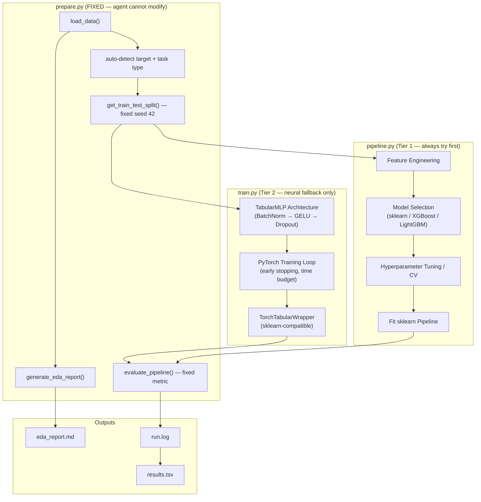
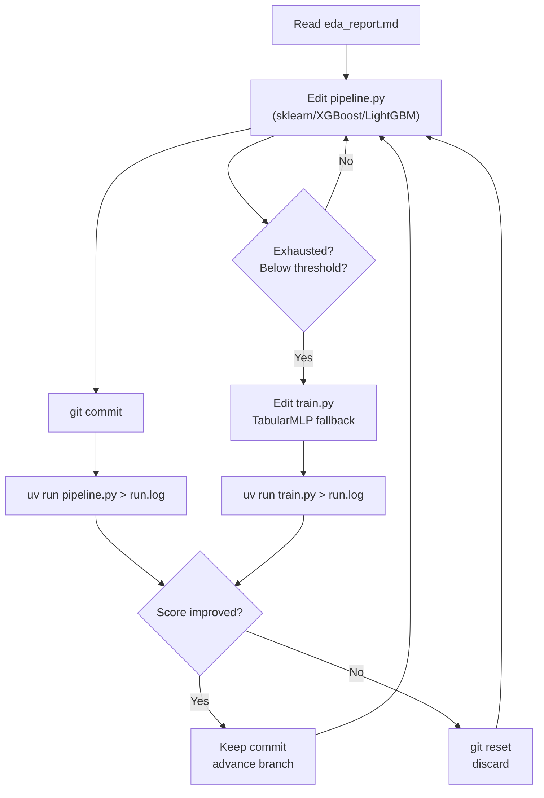

# Aora (autoresearch for data science)

Autonomous data science research agent. Drop in a dataset, let an AI agent run overnight, wake up to a log of experiments and (hopefully) a well-tuned model.

Inspired by [autoresearch](https://github.com/karpathy/autoresearch) by Andrej Karpathy — adapted from LLM pretraining research to the full tabular data science pipeline.

## How it works

The repo has four files that matter:

- **`prepare.py`** — fixed constants, auto-detects task type and target column, provides a fixed train/test split, and computes evaluation metrics. **Not modified by agents.**
- **`pipeline.py`** — the primary agent experiment file. Sklearn/XGBoost/LightGBM preprocessing, feature engineering, model selection, hyperparameter tuning. The agent starts here.
- **`train.py`** — neural network fallback (PyTorch `TabularMLP`). Used **only** if `pipeline.py` cannot exceed the escalation threshold (f1_macro < 0.70 or r2 < 0.60 after full tuning).
- **`program.md`** — baseline instructions for one agent. Point your agent here and let it go. This file is edited and iterated on by the human.

The agent edits the active file, commits, runs it, checks if the score improved, keeps or discards, and repeats — exactly like the LLM pretraining version but for tabular ML.

## Architecture



## Experiment loop



## Quick start (local)

**Requirements:** Python 3.10+, [uv](https://docs.astral.sh/uv/)

```bash
# 1. Install uv (if needed)
curl -LsSf https://astral.sh/uv/install.sh | sh

# 2. Install dependencies (includes PyTorch for the neural fallback)
cd aora
uv sync

# 3. Place your dataset in data/
cp /path/to/your/dataset.csv data/

# 4. Run data prep + EDA (~seconds)
uv run prepare.py

# 5. Check the EDA report
cat eda_report.md

# 6. Run a single baseline experiment
uv run pipeline.py
```

## Ollama + OpenClaw (autonomous sandboxed runs)

OpenClaw runs on the host and manages its own Docker sandbox for code execution. `train.py` runs on the host via `host_bridge.py` to keep Apple MPS access.

```
HOST macOS
  ├── ollama serve              ← LLM inference
  ├── uv run host_bridge.py    ← MPS runner for train.py (port 8765)
  └── openclaw (on host)
        └── sandbox (Docker, managed by OpenClaw)
                └── pipeline.py runs here — sees aora/ only
```

### One-time setup

```bash
# 1. Copy and configure environment
cp .env.example .env
# Edit .env: set OLLAMA_MODEL, optionally BRIDGE_SECRET

# 2. Install Ollama and OpenClaw
brew install ollama
ollama launch openclaw          # installs OpenClaw + web search plugin

# 3. Pull a coding model
ollama pull qwen2.5-coder:14b

# 4. Start services (2 terminals)
ollama serve                    # Terminal 1
uv run host_bridge.py          # Terminal 2

# 5. Verify bridge is healthy
curl http://localhost:8765/health
```

OpenClaw picks up `openclaw.json` from the repo root automatically — workspace, sandbox, tool allow/deny, and blocked files are all configured there.

### Security boundaries

| What | Boundary |
|---|---|
| File access | `aora/` workspace, read-only at `/agent`; `pipeline.py`, `train.py`, `tasks/` writable via bind mounts |
| Code execution | OpenClaw sandbox container (bridge network, workdir `/agent`) |
| Blocked files | `.env`, `openclaw.json` (`fs.deny`); `prepare.py` protected by read-only mount |
| host_bridge | Reached from sandbox via `host.docker.internal:8765`; whitelisted endpoints only |
| train.py | Always via bridge — never runs inside sandbox |

## Running the agent

Start OpenClaw (see Docker + Ollama + OpenClaw section below) and give it this prompt:

The agent reads `program.md`, then `prepare.py`, `pipeline.py`, `train.py`, and `eda_report.md`, and begins the autonomous experiment loop.

## Two-tier model strategy

| Tier | File | When to use | Models |
|---|---|---|---|
| **1 (always)** | `pipeline.py` | Default — start here | LogisticRegression, Ridge, RF, GBM, XGBoost, LightGBM, Ensembles |
| **2 (fallback)** | `train.py` | Only if f1 < 0.70 / r2 < 0.60 after full tuning | TabularMLP (PyTorch, CPU/MPS/CUDA) |

Tree-based methods (XGBoost, LightGBM) outperform neural networks on most tabular datasets. The neural fallback exists for edge cases: very large datasets where tree methods plateau, or high-dimensional numeric features with complex interactions.

## Auto-detection

`prepare.py` auto-detects everything from your data file:

| What | How |
|---|---|
| **Data file** | First `.csv` or `.parquet` file found in `data/` |
| **Target column** | Checks common names (`target`, `label`, `y`, `class`, etc.), falls back to last column |
| **Task type** | String/object/bool dtype → classification; integer with ≤20 unique values → classification; else regression |
| **Feature types** | Numeric (int/float), categorical (object/category/bool), drops high-cardinality text (>50 unique) |

Override via environment variables:
```bash
TARGET_COL=my_target uv run prepare.py
TASK_TYPE=regression uv run prepare.py
```

## Metrics

| Task | Primary metric | Direction |
|---|---|---|
| Classification | `f1_macro` | higher is better |
| Regression | `r2` | higher is better |

Additional metrics are logged (accuracy, precision, recall, AUC for classification; RMSE, MAE for regression) but the agent optimises only the primary metric.

## Available models (pre-installed)

**Classification (pipeline.py):** `LogisticRegression`, `RandomForestClassifier`, `GradientBoostingClassifier`, `ExtraTreesClassifier`, `SVC`, `XGBClassifier`, `LGBMClassifier`, `VotingClassifier`, `StackingClassifier`

**Regression (pipeline.py):** `Ridge`, `Lasso`, `ElasticNet`, `RandomForestRegressor`, `GradientBoostingRegressor`, `ExtraTreesRegressor`, `XGBRegressor`, `LGBMRegressor`, `VotingRegressor`, `StackingRegressor`

**Feature engineering / selection (pipeline.py):** `PolynomialFeatures`, `SelectKBest`, `RFE`, `PCA`, `SMOTE` (imbalanced-learn)

**Neural (train.py):** `TabularMLP` — PyTorch MLP with BatchNorm, GELU activations, dropout, early stopping, cosine LR schedule. Runs on CPU, MPS (Apple Silicon), or CUDA.

## Project structure

```
prepare.py        — constants, auto-detection, EDA, evaluation (do not modify)
pipeline.py       — Tier 1: sklearn/XGBoost/LightGBM template (copied into tasks/)
train.py          — Tier 2: PyTorch TabularMLP template (copied into tasks/)
host_bridge.py    — host-side MPS runner for train.py (port 8765)
openclaw.json     — OpenClaw workspace, sandbox, and tool config
program.md        — agent operating rules (human edits)
pyproject.toml    — Python dependencies
.env.example      — environment variable template (copy to .env, never commit .env)
data/             — place your dataset here
tasks/            — one subdirectory per experiment run (agent writes here)
eda_report.md     — generated by uv run prepare.py (gitignored)
```

## Design choices

- **Two-tier model strategy.** The agent always starts with `pipeline.py` (fast, interpretable, usually wins on tabular data). The neural fallback in `train.py` is a genuine last resort, not a default path.
- **Single file to modify per tier.** At any point the agent only touches one file. Diffs are small and reviewable.
- **Auto-detect everything.** No config files. Just drop in a CSV.
- **Fixed evaluation harness.** `evaluate_pipeline()` and the train/test split live in `prepare.py` and are immutable. Agents cannot cheat by re-splitting or changing the metric. The `TorchTabularWrapper` in `train.py` satisfies the same sklearn interface so `evaluate_pipeline()` works unchanged.
- **Higher-is-better convention.** Both `f1_macro` and `r2` go up as performance improves, so the keep/discard logic is the same regardless of task type or model type.
- **EDA as first-class context.** `eda_report.md` is generated before the experiment loop starts, giving the agent concrete knowledge about the dataset.
- **Time budget.** Each experiment is bounded by `TIME_BUDGET = 300` seconds. Both `pipeline.py` (via `RandomizedSearchCV` `n_iter` limits) and `train.py` (via early stopping + time guard) respect this.

## License

MIT
